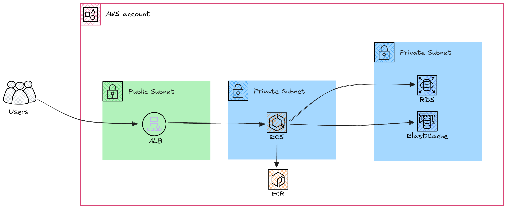

# ECS-Services-RDS-Elasticache-Pipeline
The pipeline deploys ECS services with frontend and backend containers, RDS and Elasticache databases using terraform and GitHub acctions. All services are connected using Security Groups and placed in the custom VPC.

## Technologies Used:

#### * _AWS Services_
#### * _GitHub Actions_
#### * _Terraform_


## Prerequisites

- AWS Account
- Github Account

Resource diagram:



## AWS Infrastructure description

* Amazon Elastic Container Service (ECS):

Runs frontend and backend applications packed in docker containers.

* Amazon Relational Database Service (RDS):

Provides a managed database for backend operations.

* Amazon ElastiCache:

Caching service (on Redis engine) for performance optimization.

* Amazon Elastic Container Registry (ECR):

Stores Docker images for the deployment.

* Application Load Balancer (ALB):

Balances the traffic for frontend service.

## Deploying the project

### Step 1: Fork and Clone
Fork the repository to your GitHub account. Clone the repository to your local machine for configuration or modifications.

### Step 2: Set Up Secrets
Go to Settings > Secrets and Variables > Actions in your GitHub repository.
Add the secrets for AWS:

```sh
AWS_ACCESS_KEY_ID: IAM access key for AWS API operations.
AWS_SECRET_ACCESS_KEY: Secret key paired with the access key.
AWS_REGION: The AWS region where resources will be created (e.g., us-east-1).
```

### Step 3: Deploy AWS Resources
Trigger the _deploy-project_ workflow to deploy whole infrastructure.

### Step 4: Confirm Resources Status
Validate that the AWS resources are live:

Check ECS Cluster Tasks for running and instpect logs.
Verify RDS and ElastiCache instances are available using the AWS Management Console or CLI.

### Step 5: Access the frontend webpage using Load Balancer Endpoint
Copy ALB endpoint from your GitHub Action logs and access the frontend page. 

> Note: Use `http://` connection for this project.

## Removing Resources: 

Use `destroy-resources` workflow to remove recouerces

## Key Notes:

> Resource Costs:
 Ensure you understand AWS pricing to manage project costs effectively. `ECS configuration for this project isn't free!` 

> Security:
 Use least privilege access for AWS credentials. `Don't paste AWS credentials anywhere excluding GitHub Secrets`

> Debugging:
 You can monitor the infrastructure deploying in GitHub Action logs, and findout errors if they present.

> Documentation:
 Don't foget to update the repository’s README.md to reflect current workflows and configurations.


## Environmental variables:
Variables for backend used by example phyton code, if you wanna use your own containers you should provide yours in the _deploy-backend.yml_.

        DB_NAME
        DB_USER
        DB_PASSWORD 
        DB_PORT 
        
        REDIS_PORT 


